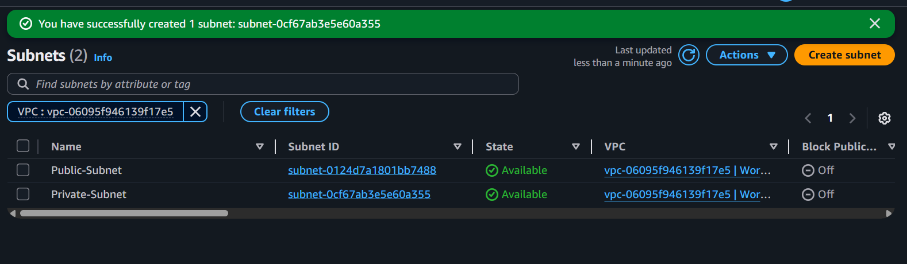
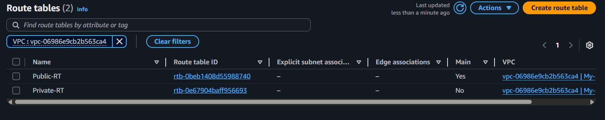

# 🌐 Deploying WordPress on AWS with Custom VPC

This project showcases the deployment of a **WordPress-based web application** using the **LAMP stack** inside a **custom Virtual Private Cloud (VPC)** on Amazon Web Services (AWS).

---

## 📌 Project Overview

This project sets up a secure and scalable WordPress environment with:

- A **Custom VPC** with:
  - **Public Subnet**: EC2 instances running WordPress + Apache
  - **Private Subnet**: EC2 instance running MariaDB (MySQL-compatible DB)
- **Security Groups** for fine-grained traffic control
- **Internet Gateway** and **NAT Gateway** for network access
- **Bastion Host** for secure SSH into private resources

---

## 🧱 Architecture Diagram (Basic)


---

## 🛠️ Step-by-Step Setup Guide

### 1️⃣ Create a Custom VPC

- Name: `WordPressVPC`
- CIDR Block: `10.0.0.0/16`


### 2️⃣ Create Subnets

- Public Subnet: `10.0.1.0/24`
- Private Subnet: `10.0.2.0/24`





### 3️⃣ Internet Gateway & Routing

- Create an Internet Gateway (IGW) and attach it to your VPC
- Update public route table:
  - Destination: `0.0.0.0/0`
  - Target: IGW
- Associate the public subnet with this route table


### 4️⃣ NAT Gateway (Optional for DB access)

- Allocate an Elastic IP
- Launch NAT Gateway in the **public subnet**
- Create a new route table for the **private subnet**
  - Add route: `0.0.0.0/0` → NAT Gateway


---

## 🧰 Launch EC2 Instances

### App Server 1 & 2 (WordPress + Apache)
- Amazon Linux 2 
- Public Subnet with auto-assign public IP
- Attach Security Group: `App-SG`

### DB Server (MariaDB)
- Amazon Linux 2 
- Private Subnet (no public IP)
- Attach Security Group: `DB-SG`


---

## 🔐 Configure Security Groups

| Name      | Port(s) | Source             | Purpose                |
|-----------|---------|--------------------|------------------------|
| App-SG    | 22, 80  | Your IP / 0.0.0.0  | SSH + HTTP access      |
| DB-SG     | 3306    | App-SG or 10.0.1.0 | Allow DB access only   |


---

## 🖥️ Install WordPress on App Server

SSH into App Server:

```bash
ssh -i "your-key.pem" ec2-user@<Public-IP>
```


Install packages:

```bash
sudo yum update -y
sudo yum install -y httpd php php-mysqlnd wget unzip
sudo systemctl enable httpd
sudo systemctl start httpd
```


Download and configure WordPress:
```bash
cd /var/www/html
sudo wget https://wordpress.org/latest.zip
sudo unzip latest.zip
sudo cp -r wordpress/* .
sudo chown -R apache:apache /var/www/html
sudo chmod -R 755 /var/www/html
```


## 🛢️ Install & Configure MariaDB on DB Server

SSH from App Server:
```
ssh -i "your-key.pem" ec2-user@<DB-Private-IP>

```
Install MariaDB:

```
sudo yum update -y
sudo yum install -y mariadb-server
sudo systemctl start mariadb
sudo systemctl enable mariadb
```


Create WordPress DB:

```
sudo mysql -u root -p

CREATE DATABASE wordpress;
CREATE USER 'wpuser'@'10.0.%' IDENTIFIED BY 'StrongPassword123!';
GRANT ALL PRIVILEGES ON wordpress.* TO 'wpuser'@'10.0.%';
FLUSH PRIVILEGES;
EXIT;
```


## ⚙️ Configure wp-config.php on App Server

```
define('DB_NAME', 'wordpress');
define('DB_USER', 'wpuser');
define('DB_PASSWORD', 'StrongPassword123!');
define('DB_HOST', '<DB-Private-IP>');
```
Restart Apache:

```
sudo systemctl restart httpd
```

## 🌐 Access WordPress

Open in browser:
```
http://<App-Server-Public-IP>
```


## 🔒 Best Practices

✅ Use NAT Gateway for secure updates in private subnet

✅ Store credentials in AWS Secrets Manager or SSM

✅ Backup DB using RDS snapshot or cron

✅ Harden EC2 access using Bastion Host

---

## ✅ Outcome
You now have a secure and production-ready WordPress app running in a custom VPC with separate app and DB layers, following real-world AWS architecture standards.

---
## 🙌 Connect With Me
📬 [LinkedIn](https://www.linkedin.com/in/pratik-das-a47493231)  
💬 Let's connect and discuss AWS, Linux, or DevOps!